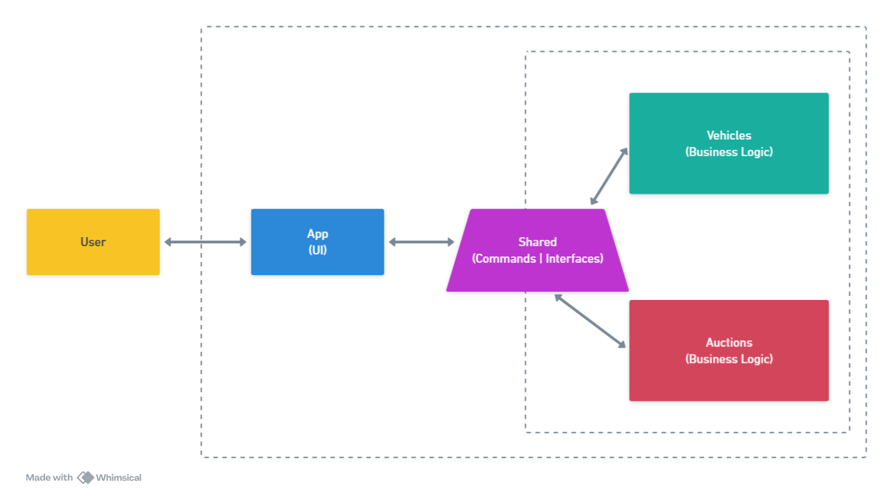

# Vehicle Auction Management System (VAMS)

## Description
Simple Vehicle Auction Management System. The system should handle different types of vehicles: Sedans, SUVs, Hatchbacks and Trucks. 

## Features

- Add a vehicle
- Retrieve available vehicles
- Search vehicles by criteria
- Start an auction for one or more vehicles
- Place a bid on a vehicle, during an open auction
- End an auction
- List auctions

## Technologies
- **IDE:** Visual Studio 2022
- **Design:** OOP Design Principles (Abstraction, Encapsulation, Inheritance) | Design Patterns (Factories, Repository, CQRS) | Domain Driven Design (Entities, Services, ValueObjects)
- **Tests:** TDD, xUnit, Bogus, NSubstitute and FluentAssertions
- **Code:** .NET Core 9.0, C# 12.0, Git

## Architecture



## Considerations
- I've chosen a clean architecture, focused on the domain logic isolation and the separation of concerns, because it's easy to understand and modify.
- I've opt in for a test driven development approach, commiting after refactoring the tess due to the last changes made.
- I've decided to not use so many comments in the code and try to use naming and other convetions instead, leaving the comments for most important things only.
- I've decided to implement app as a console application because it can work as a simple UI for the system, but it could be easily replaced by an API or a gRPC service.
- I've coded the solution in around 9 non-continuous hours, from last friday to tuesday morning.
- When using Visual Studio, I used features like IntelliSense and Copilot to help me with technical questions, code completion and hints about general coding aspects.

## How to run
1. Clone the repository
2. Open the solution in Visual Studio
3. Run the Tests project or run ```dotnet test ./Tests/Tests.csproj``` command from the solution root folder.
4. Run the App project or run ```dotnet run --project ./App/App.csproj``` command from the solution root folder.
5. Run the (0) Happy Path option if you want to check all the features properly.
6. Run any other operation (that will use random dummy data) and expect to work properly or throw an exception.